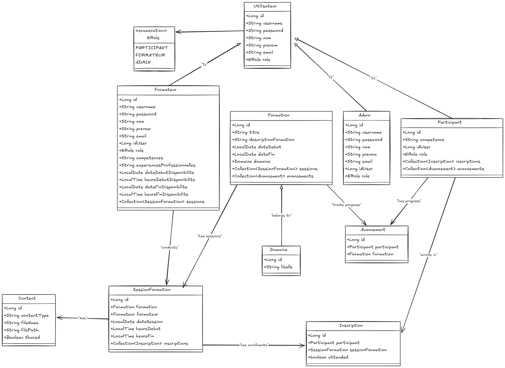
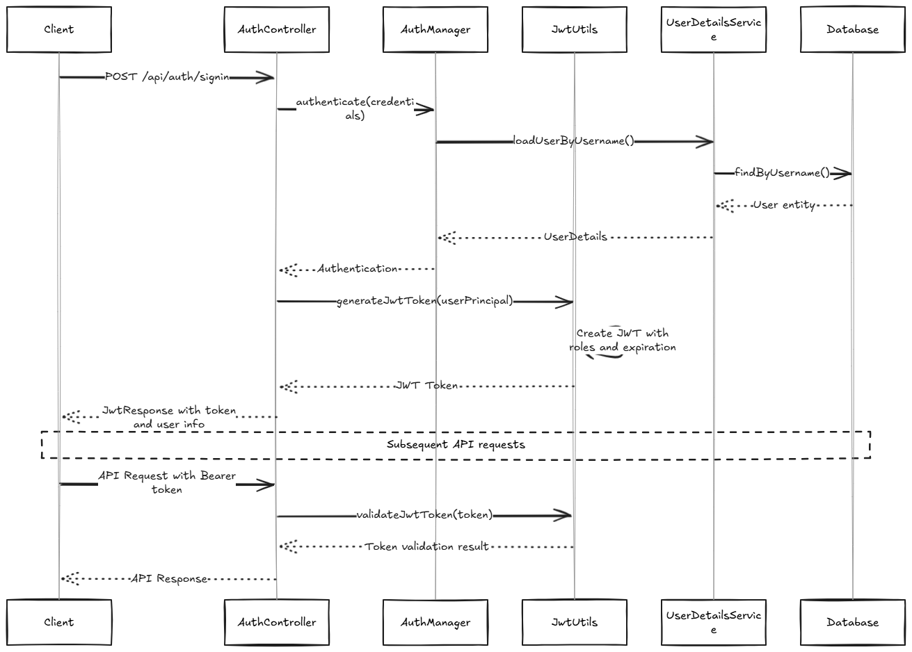
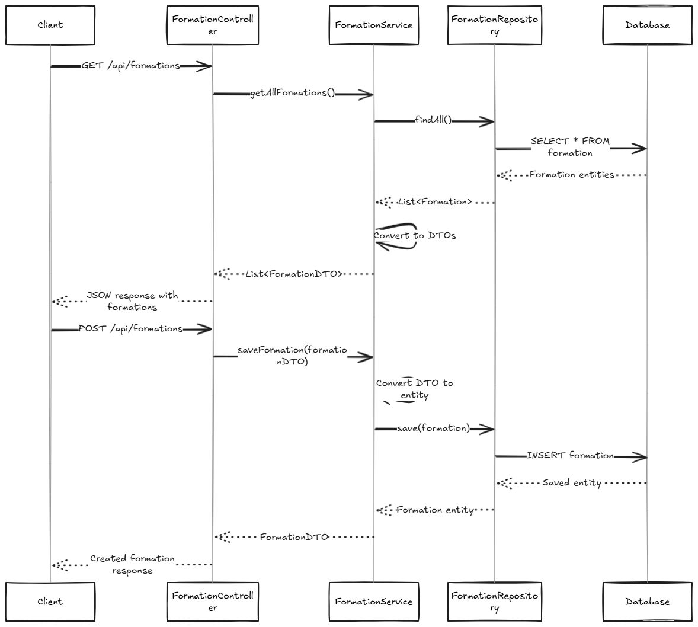

# Training Management System - Backend

This repository contains the **backend API** for the Training Management System, a comprehensive platform for managing training programs, participants, instructors, and educational content.

## Overview

The Training Management System backend is built with **Spring Boot** and provides RESTful APIs for managing training formations, user authentication, content sharing, and progress tracking. The system supports three distinct user roles with different access levels and capabilities.

## Core Features

### 🔐 Authentication & Security
- **JWT-based Authentication**: Stateless authentication using JSON Web Tokens
- **Role-based Access Control**: Three user types (PARTICIPANT, FORMATEUR, ADMIN)
- **Spring Security Integration**: Comprehensive security configuration with custom filters
- **Password Encryption**: BCrypt password encoding for secure storage

### 👥 User Management
- **Multi-role User System**: Base user entity with role-specific extensions
- **Participant Management**: Training participants with competence tracking
- **Instructor Management**: Formateurs with availability scheduling and professional experience
- **Admin Operations**: System administrators with full platform access

### 📚 Training Management
- **Formation Management**: Complete CRUD operations for training programs
- **Domain Categorization**: Hierarchical organization of training programs by subject areas
- **Progress Tracking**: Participant advancement monitoring through sessions
- **Session Management**: Individual training session scheduling and attendance tracking

### 📁 Content Management
- **File Storage**: Local file storage system for training materials
- **Content Sharing**: Shareable digital resources (PDFs, videos, images)
- **Multi-format Support**: Support for various content types and file formats

## Technology Stack

- **Framework**: Spring Boot 3.2.6
- **Security**: Spring Security with JWT
- **Database**: MySQL with JPA/Hibernate
- **Build Tool**: Maven
- **Java Version**: 17

## Architecture Diagrams

### Class Diagram


### Use Case Diagram


### Authentication Sequence Diagram


### Formation Management Sequence Diagram



## API Endpoints

### Authentication
- `POST /api/auth/signin` - User login
- `POST /api/auth/signup` - User registration
- `POST /api/auth/sign-out` - User logout

### User Management
- `GET /api/participants` - List all participants
- `POST /api/participants` - Create participant
- `PUT /api/participants/{id}` - Update participant
- `DELETE /api/participants/{id}` - Delete participant

### Formation Management
- `GET /api/formations` - List all formations
- `POST /api/formations` - Create formation
- `PUT /api/formations/{id}` - Update formation
- `DELETE /api/formations/{id}` - Delete formation

### Content Management
- `POST /api/content/upload` - Upload training content
- `GET /api/content/{id}/download` - Download content
- `PUT /api/content/{id}/share` - Share content

## Getting Started

1. **Prerequisites**
    - Java 17+
    - MySQL 8.0+
    - Maven 3.6+

2. **Database Setup**
    - Create MySQL database
    - Configure connection in `application.properties`

3. **Run Application**
   ```bash  
   ./mvnw spring-boot:run  
   ```  

4. **API Documentation**
    - Access Swagger UI at `http://localhost:8080/swagger-ui.html`

## Contributing

1. Fork the repository
2. Create a feature branch
3. Commit your changes
4. Push to the branch
5. Create a Pull Request
